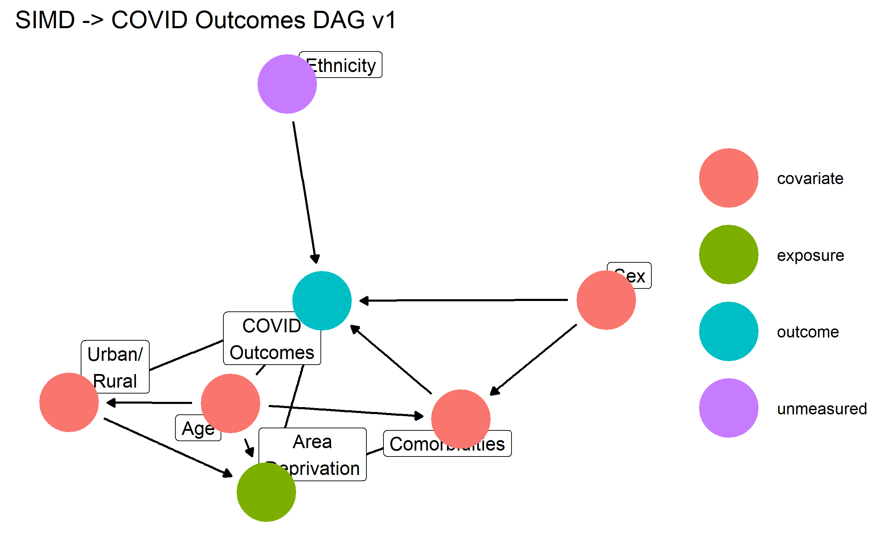

# COVID_Inequalities

Repository for files related to NHS Grampian COVID Inequalities Registered Report

## 1. Directed Acyclic Graphs

In this project we are using Directed Acyclic Graphs (DAGs) to visualise the assumptions we have about the relationships between variables. Each 'node' represents a variable (or set of variables) and the arrows between them indicate the assumed directed of a causal relationship. Making these assumptions explicit means that we can work out which variables we need to adjusted for in modeling in order to properly estimate the effect of our exposure on the outcome(s).

DAGs are directed because they have a single arrowhead indicating an effect. Acyclic means that we do not visualise feedback loops. The best way to think about this is that DAGs represent a single point in time.

